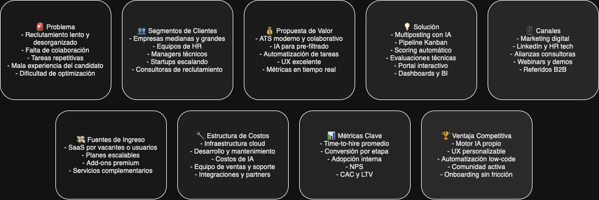
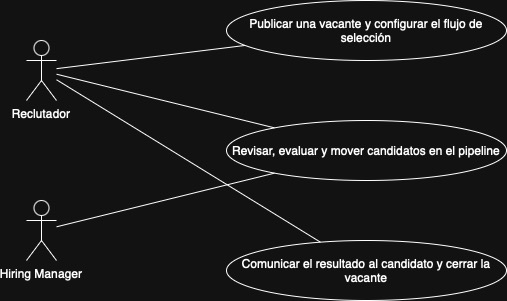
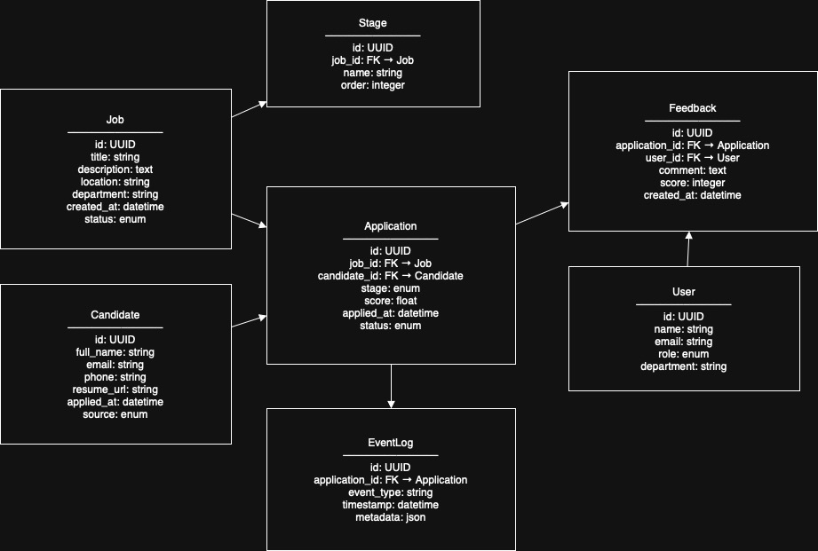
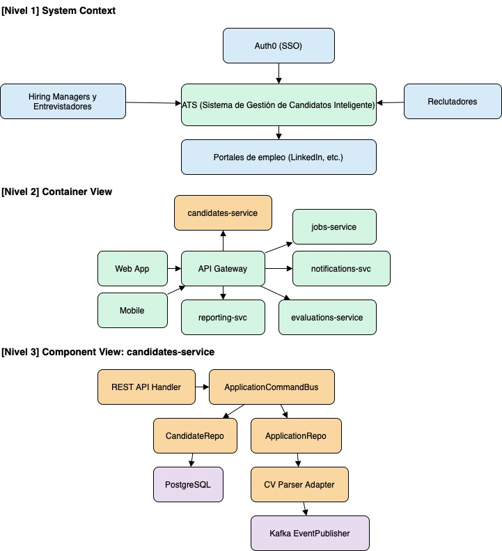

# 1. LTI - Sistema de gestión de candidatos diferenciador

Un sistema de gestión de candidatos (ATS) moderno y competitivo es una plataforma centralizada que **automatiza, agiliza y optimiza todo el ciclo de vida del reclutamiento**, desde la publicación de vacantes hasta la contratación. Lo que lo hace destacar frente a la competencia es su enfoque **colaborativo, inteligente y centrado en la eficiencia**:

> 💡 "Un ATS inteligente que conecta a reclutadores, hiring managers y candidatos en un entorno fluido, automatizado y con asistencia de IA en cada etapa del proceso."

---

### 💎 Valor añadido y ventajas competitivas

1. **Eficiencia operativa radicalmente mejorada**

   - Flujos de trabajo automatizados para screening, entrevistas, y comunicaciones.
   - Reglas configurables que reducen tareas manuales.
   - Integraciones con calendarios, correo y portales de empleo.

2. **IA para decisiones más inteligentes**

   - Recomendaciones de candidatos basadas en matching de skills y cultura.
   - Generación automática de descripciones de puestos y correos personalizados.
   - Detección de duplicados, patrones de éxito y posibles sesgos.

3. **Colaboración en tiempo real**

   - Comentarios en fichas de candidatos.
   - Evaluaciones compartidas con visibilidad por rol.
   - Notificaciones sincronizadas entre reclutadores y managers.

4. **Experiencia de candidato superior**

   - Portal moderno, responsive y transparente para aplicar y seguir el proceso.
   - Automatización de respuestas y feedback inmediato post-entrevista.
   - Aplicaciones one-click y entrevistas sin fricción.

5. **Informes y métricas accionables**

   - Dashboards personalizables para time-to-hire, funnel de conversión, fuentes más efectivas.
   - KPIs segmentados por equipo, tipo de posición o ubicación.

6. **Arquitectura flexible y conectable**

   - API RESTful para integraciones (Slack, Notion, Greenhouse, Workday, etc.).
   - Webhooks y eventos para automatizar acciones en otros sistemas.
   - Multilenguaje y multi-región para empresas globales.

---

### 🥇 ¿Qué lo hace brillar?

- IA asistida **para ahorrar tiempo sin perder control**.
- Foco en **colaboración cross-equipo**, no solo en procesos.
- Experiencia fluida tanto para **usuarios internos como candidatos**.
- Modular, personalizable y **rápido de implementar**.

## 2. Funciones principales

Claro, acá va una **lista de funciones principales de un sistema de gestión de candidatos (ATS)**, con su descripción breve. Las agrupé por etapas del proceso para reflejar cómo aportan valor en cada momento del ciclo de contratación:

---

### 🧩 **1. Publicación y gestión de vacantes**

- **Creación de puestos y aprobaciones**
  Formularios personalizables para crear nuevas vacantes con flujos de aprobación automáticos.

- **Multiposting automatizado**
  Publicación en múltiples portales (LinkedIn, Indeed, portal interno, etc.) desde un solo lugar.

- **Generación asistida por IA de descripciones de puesto**
  Redacción automática optimizada para atraer talento y evitar sesgos.

---

### 🔍 **2. Atracción y sourcing**

- **Formulario de aplicación personalizable**
  Permite adaptar los campos requeridos por rol, país o seniority.

- **Candidaturas internas y referidos**
  Soporte para postulaciones internas y recomendaciones de empleados con tracking de recompensas.

- **Integración con fuentes externas y CRM**
  Ingesta automática de CVs desde correo, ferias, campañas outbound o bases previas.

---

### 🧠 **3. Screening y evaluación**

- **Parseo inteligente de CVs**
  Extrae y estructura la información clave automáticamente.

- **Scoring automático de candidatos**
  Algoritmos de matching que ordenan los perfiles según fit técnico y cultural.

- **Video entrevistas asincrónicas y técnicas de evaluación**
  Integración de evaluaciones técnicas, tests de lógica o soft skills.

---

### 📆 **4. Gestión del pipeline**

- **Kanban de etapas personalizable**
  Visualización clara de candidatos por fase (screening, entrevista técnica, oferta...).

- **Notas y evaluaciones colaborativas**
  Varios evaluadores pueden dejar feedback visible y estructurado.

- **Entrevistas y coordinación con calendario**
  Invitaciones automáticas, disponibilidad compartida y videollamadas integradas (Zoom, Meet).

---

### 📬 **5. Comunicación con el candidato**

- **Plantillas de mensajes automáticos y personalizados**
  Correos para cada etapa (invitación, rechazo, oferta) con campos dinámicos.

- **Portal del candidato**
  Vista amigable con estado del proceso, fechas clave, entrevistas próximas, etc.

- **Chat o notificaciones en tiempo real (opcional)**
  Para acelerar procesos en perfiles críticos.

---

### 📊 **6. Reportes y analítica**

- **Dashboards personalizables**
  Métricas clave como time-to-fill, tasa de conversión, fuentes efectivas.

- **Análisis de diversidad, inclusión y sesgos**
  Seguimiento de objetivos DEI y cumplimiento normativo.

- **Exportaciones y conectores BI**
  Para analizar datos en herramientas como Looker, Power BI, Tableau.

---

### 🧰 **7. Automatizaciones y configuraciones**

- **Workflows automáticos**
  Triggers por etapa, tiempo o acción (ej. enviar test tras aplicación, cerrar vacante si pasan 30 días).

- **Permisos y roles granulares**
  Distintos niveles de acceso según rol (reclutador, manager, legal, etc.).

- **Integraciones vía API y webhooks**
  Con otros sistemas (payroll, ERP, Slack, Google Calendar, etc.).

---

### 🔐 **8. Seguridad y cumplimiento**

- **Gestión de consentimientos y privacidad (GDPR, CCPA, etc.)**
  Consentimiento para tratamiento de datos, políticas claras y borrado automático.

- **Audit logs y backup**
  Registro de acciones por usuario, con backups periódicos.

## 3. Modelo de negocio

## 4. Casos de uso principales

Los 3 casos de uso principales para un sistema de gestión de candidatos (ATS) inteligente y colaborativo cubren el flujo principal de contratación, alineado a procesos reales de RRHH y contratación técnica.

### 1. **Publicar una vacante y configurar el flujo de selección**

#### Actor principal: Reclutador

#### Descripción:

El reclutador crea una nueva vacante, define los requisitos del puesto y configura el pipeline de selección con etapas personalizadas.

#### Pasos:

1. Accede al módulo de creación de vacantes.
2. Carga título, descripción, ubicación, modalidad y requisitos del rol.
3. Elige las fuentes de publicación (LinkedIn, portal interno, etc.).
4. Define etapas del proceso: screening → entrevista técnica → oferta.
5. Activa reglas automáticas (por ejemplo: enviar test técnico tras aplicar).
6. Publica la vacante.

#### Resultado esperado:

La vacante queda publicada y lista para recibir postulaciones con el pipeline ya configurado.

---

### 2. **Revisar, evaluar y mover candidatos en el pipeline**

#### Actor principal: Reclutador / Hiring Manager

#### Descripción:

Los responsables del proceso visualizan y colaboran en la evaluación de los candidatos, dejando comentarios, puntuaciones y moviéndolos de etapa.

#### Pasos:

1. Visualizan el panel tipo kanban de candidatos por etapa.
2. Acceden a la ficha de un candidato.
3. Revisan CV parseado, skills, historial y notas de entrevistas anteriores.
4. Dejan una evaluación y comentarios.
5. Mueven al candidato a la siguiente etapa (o lo descartan).
6. Reciben notificaciones cuando un colega deja feedback.

#### Resultado esperado:

El candidato avanza (o es descartado) con registro de evaluaciones y acciones trazables.

---

### 3. **Comunicar el resultado al candidato y cerrar la vacante**

#### Actor principal: Reclutador

#### Descripción:

Una vez tomada la decisión final, el reclutador comunica el resultado (oferta u otra respuesta) y, si corresponde, cierra la vacante.

#### Pasos:

1. Selecciona el candidato finalista.
2. Envía oferta o correo personalizado desde plantilla.
3. Marca a otros candidatos como no seleccionados.
4. Cierra la vacante si se completó la contratación.
5. Genera reporte del proceso para análisis posterior.

#### Resultado esperado:

El candidato seleccionado recibe la oferta, y el proceso se da por cerrado, con métricas actualizadas.

### Diagrama UML parcial

## 4. Modelo de datos (DER)

## 5. Diseño del Sistema a Alto Nivel – ATS Inteligente

### ⚙️ **1. Arquitectura General: Microservicios + API Gateway + SSO**

El sistema se compone de:

- **Frontends independientes**: Web (React) y Mobile (React Native)
- **API Gateway**: punto de entrada único, validación de JWT y enrutamiento interno
- **Servicios desacoplados por dominio**: siguiendo un enfoque DDD
- **SSO con Auth0**: autenticación unificada vía JWT
- **Infraestructura cloud-agnóstica**: deployable en AWS, GCP, Azure o bare metal
- **Bus de eventos** para comunicación asíncrona entre servicios

---

### 🧩 **2. Componentes Principales**

#### 🔐 Autenticación & Autorización

- **Auth0** con soporte para SSO empresarial (Google, Microsoft, SAML)
- Claims custom: `tenant_id`, `role`, `user_id`
- JWT verificado por API Gateway
- Autorización via **RBAC multitenant** en cada servicio

#### 🌐 API Gateway

- Enrutamiento hacia microservicios
- Middleware para validación de tokens, control de rate-limit, auditoría
- Puede ser Kong, Traefik, Express Gateway o uno propio

---

### 🧱 Microservicios Principales

Cada servicio es **stateless**, expone APIs REST (o gRPC) y se comunica también por eventos.

#### 1. `jobs-service`

- CRUD de vacantes
- Gestión de pipelines por puesto o tenant
- Publicación en portales (multiposting)
- Webhooks para alertar integraciones

#### 2. `candidates-service`

- CRUD de candidatos
- Aplicaciones por vacante
- Parseo de CVs
- Seguimiento por etapa

#### 3. `evaluations-service`

- Evaluaciones técnicas, entrevistas, entrevistas grabadas
- Puntajes, criterios configurables
- Feedback colaborativo (por usuario y por etapa)

#### 4. `notifications-service`

- Envío de emails, notificaciones push o Slack
- Configuración por evento: nuevos aplicantes, entrevista agendada, etc.
- Soporte para notificaciones masivas y recordatorios

#### 5. `reporting-service`

- Recolecta eventos y métricas para generar KPIs
- Expone dashboards y permite exportaciones (CSV, PDF)
- Opcionalmente se conecta a BigQuery, Redshift, ClickHouse

---

### 🛢️ **Bases de Datos**

- Cada microservicio gestiona **su propia base de datos** (PostgreSQL o MongoDB)
- Separación clara por bounded context
- **Sin acceso cruzado a BD** (comunicación solo vía API/Eventos)

---

### 🔁 **Event Bus**

- Kafka o RabbitMQ para comunicación asincrónica
- Ejemplos de eventos:

  - `CandidateApplied`
  - `StageChanged`
  - `InterviewScheduled`
  - `FeedbackSubmitted`

Los servicios pueden **emitir y/o suscribirse** según su necesidad.

---

### 📱 Frontends

#### Web (React)

- Panel completo: vacantes, candidatos, evaluaciones, métricas
- Interfaz para recruiters y hiring managers
- Administra usuarios y permisos

#### Mobile (React Native)

- Revisión rápida de candidatos
- Feedback en entrevistas
- Notificaciones y acciones rápidas para managers

Ambos consumen el mismo backend vía API Gateway, autenticados con tokens de Auth0.

---

### 🧰 Infraestructura

- **Cloud agnóstico**: Docker + Kubernetes + Terraform
- Observabilidad: ELK o Loki para logs, Prometheus + Grafana para métricas
- CI/CD: GitHub Actions / GitLab CI
- Testing: Contratos API + tests e2e con Cypress/Detox

---

### 🔄 Multitenancy

- Cada tenant tiene:

  - Su configuración (pipeline, branding, usuarios)
  - Su aislamiento lógico (en base de datos por tenant o por row-level)

- Tenancy resuelta vía claims de Auth0 + enforcement en cada servicio

---

### 🔌 Integraciones Externas

- Slack: alertas de candidatos, entrevistas
- Calendarios (Google, Outlook): scheduling
- Portales de empleo: LinkedIn, Indeed, etc.
- Test técnicos: HackerRank, Codility, evaluaciones propias

## 6. Diagrama C4

Elijo como foco el microservicio **`candidates-service`**, porque está en el corazón del ATS: gestiona postulaciones, candidatos, matching, tracking y estado del pipeline.

